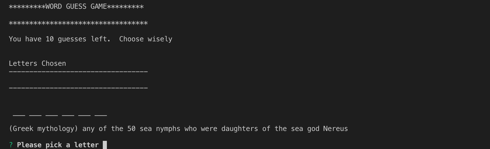
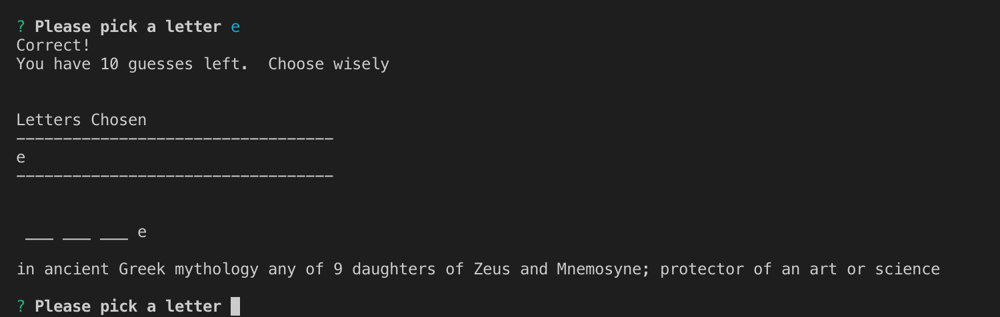
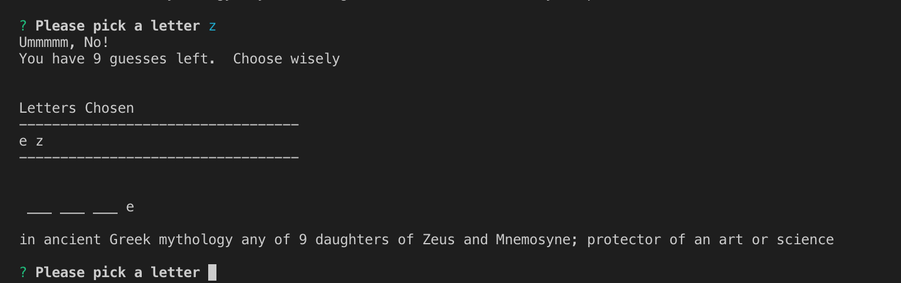
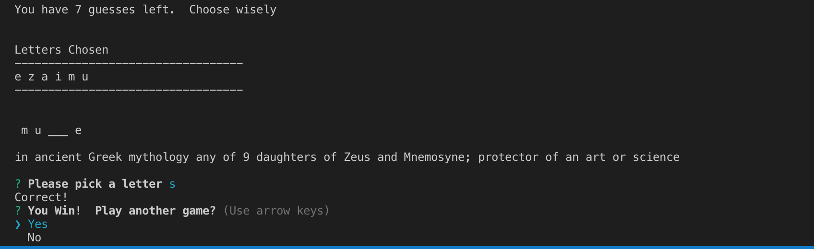

# wordGuessConstructors
Hangman command line game using constructor functions

# liri_node_app
A node app using Inquirer that can play hangman using designated words

**and NPM packages:**
inquirer, fs

This project is useful for teaching children spelling along with definitions or just good ole' fashion hangman.

You can get started by simply installing the inquirer npm and calling node index.js in the command terminal.

This project is contributed to and maintained by **Matthew Madison**

## WALKTHROUGH

Opens up with a basic prompt asking you to pick a letter and shows the dashes for the letter and gives a definition

When you pick a letter it records it if right and reduces your guesses if incorrect

When the game is over either max guesses used up or 
The game lets you know if you won or lost and asks you if you'd like to play again

